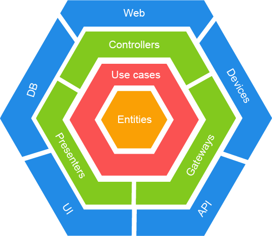

# Hands-on Frontend Series : Clean Architecture

After having discovered the main frontend application development frameworks through the previous hands-ons, we will now see how to architect our application. 

The goal of a good architecture is to gain in testability, scalability and maintainability. We will also see that a good architecture will allow us to depend less on frameworks and tools to develop applications that are more resilient to changing technologies.

The concept of "Clean Architecture", also known as "Hexagonal Architecture" or "Ports / Adapters Architecture" has already proven its worth in the development of backend applications.

While this technique has gained in popularity in recent years, it has not become much democratized in frontend application development.

We therefore invite you to come and discover the fundamentals of Clean Architecture and see how to implement it in a web application. 

Through this repository, we redevelop the weather forecast application from the concepts of "Clean Architecture".

## Prerequisite

- nodejs > 10

## Install

```
npm install
```

## Usage

### Angular

```
npm run angular 
```

### React

```
npm run react
```

## Structure



* **packages/domain** : Core of business application (city, weather, port)
* **packages/web/adapters** : Class used to make infrastructure communicate with domaine 
* **packages/web/infrastructure** : Weather app with frameworks usage 

## Technologies

### Langage

* Typescript

### Tools / Libraries

* Lerna
* Angular
* React
* Jest
* @testing/library

## Other Hands-on

### Front

* [VueJS](https://github.com/Zenika/grenoble-hands-on-vuejs)
* [Angular](https://github.com/Zenika/grenoble-hands-on-angular)
* [React](https://github.com/Zenika/grenoble-hands-on-react)

### Backend

* [Spring](https://github.com/Zenika/grenoble-hands-on-spring)
* [Quarkus](https://github.com/Zenika/grenoble-hands-on-quarkus)

## Contributing

<a href="https://github.com/chocho01">
  
</a>


